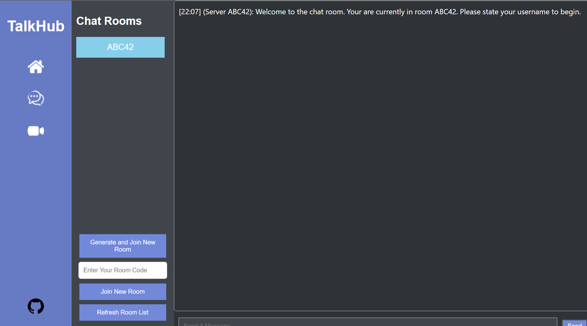
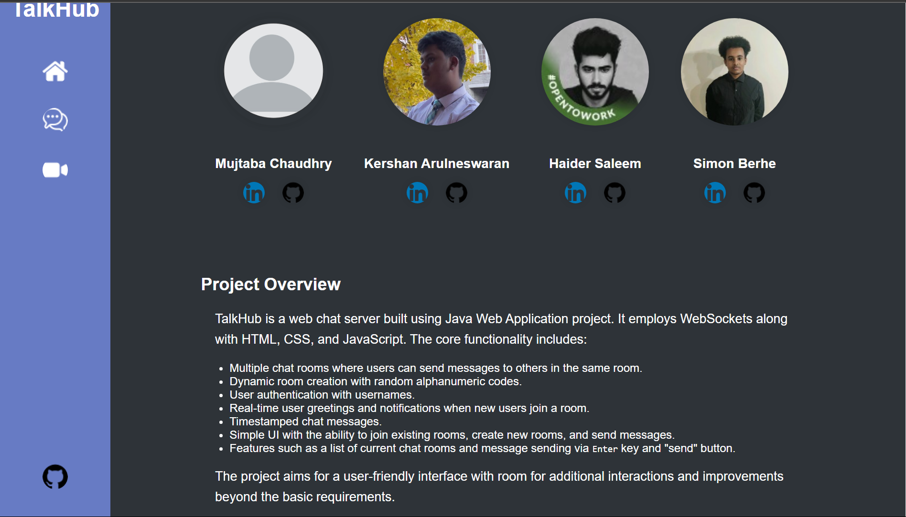

# Assignment 02 - Chat Room
## Project Information

Our project is a web chat server implemented using Java Web Applications. It makes real-time communication between multiple users through chat rooms. The server utilizes WebSockets along with HTML, CSS, and JavaScript for client-side interaction. The primary goal of this project is to create a user-friendly and efficient chat and video platform where users can seamlessly join existing rooms, create new ones, and interact with each other.

### Screenshot




### Group Members

- Kershan Arulneswaran - Backend (Creating and Adding Rooms)
- Haider Saleem - Backend (Messaging)
- Simon Berhe - VideoChat, ReadME
- Mujtaba Chaudhry - FrontEnd

## Improvements

1. Enhanced User Interface: We have put effort into improving the aesthetics of the screen to provide a more visually appealing and intuitive user experience.

2. Additional Interaction Features: Inspired by other popular chat server applications, we have incorporated features such as displaying current usernames in the room, user status messages and improved chat message formatting.

3. Room Code Entry: Users can now enter a specific room code to join a particular chat room directly, facilitating easier access to specific conversations.

4. Video Chat Feature: As an extra feature, we have implemented a video chat functionality within the application, allowing users to engage in face-to-face conversations alongside text chatting.

## How to Run

1. Clone the repository using the command:
   ```bash
   git clone https://github.com/OntarioTech-CS-program/w24-csci2020u-assignment02-arulneswaran-berhe-chaudhry-saleem/
2. Open in IntelliJ IDEA as Admin with the folder: /w24-csci2020u-assignment02-arulneswaran-berhe-chaudhry-saleem
3. Edit the configuration so that the URL is http://localhost:8080/WSChatServer-1.0-SNAPSHOT/
4. Deploy GlassFish Server and Enjoy!
   
## Other Resources
Other than the traditional Jakarta EE, Java.io, Hashmap and ArrayList Librarys, we have two main links one for the ChatServer.java file and the second was a website which allowed us to implement a video chat feature

[1] [Agora](https://www.agora.io/en/)
[2] [Websockets ChatServer](https://github.com/OntarioTech-CS-program/WebSocketsChatServer/tree/main)


